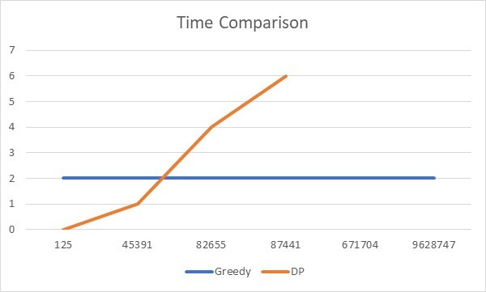

# Codeforces 996A Hit the Lottery using Greedy & Dynamic Programming

This repository will solve problem [996A Hit the Lottery](https://codeforces.com/problemset/problem/996/A) using Greedy Algorithm and Dynamic Programming, and analyze each of its perks to find which is better.

### Team Members:
- Johny Huang
- Leon Chrisdion
- Nicholas Prawiro Chen
- Sutedja The Hoping

### Programming Language:
- C++ 11

### Installation/Running Instructions:
- Install TDMGCC and change compiler settings to be using TDMGCC
- Compile and execute the source code that can be found in this repository using GNU G++11 5.1.0

### Problem:
<p align="center">
<b>Hit the Lottery</b><br>
<b>time limit per test: 1 second</b><br>
<b>memory limit per test: 256 megabytes</b><br>
<b>input standard input</b><br>
<b>output standard output</b><br>  
</p>

<p align="justify">
Allen has a LOT of money. He has n dollars in the bank. For security reasons, he wants to withdraw it in cash (we will not disclose the reasons here). The denominations for dollar bills are 1, 5, 10, 20, 100. What is the minimum number of bills Allen could receive after withdrawing his entire balance?
</p>
Input:

The first and only line of input contains a single integer n (1≤n≤109).


Output:

Output the minimum number of bills that Allen could receive.

### Sample Testing:

**Sample #1:**

Input:
```
125
```
Output:
```
3
```

**Sample #2:**

Input:
```
43
```

Output:
```
5
```

**Sample #3:**

Input:
```
1000000000
```
Output:
```
10000000
```

### Note:

In the first sample case, Allen can withdraw this with a 100 dollar bill, a 20 dollar bill, and a 5 dollar bill. There is no way for Allen to receive 125 dollars in one or two bills.

In the second sample case, Allen can withdraw two 20 dollar bills and three 1 dollar bills.

In the third sample case, Allen can withdraw 100000000 (ten million!) 100 dollar bills.

### Explanation:

This problem is a classic minimum coin change problem. The objective of this problem is to find the minimum number of bills we use to make a specified amount of money, given that we have unlimited amounts of 1, 5, 10, 20, 100 bills.

### Greedy Solution:

The greedy way of solving this problem is by taking as many 100 bills as possible, followed by 20 bills, 10 bills, 5 bills and 1 bills.
This is done by checking if the given amount of ```money``` is greater than 100, if it is then it will divide ```money``` by 100 to get 
the most number of 100 bills we can take. We then reduce ```money``` by the amount of money we have already taken in 100 bills, and 
repeat the process with the next iteration of bills.

```c++
if(n/100)   //Checks if its possible to use 100 bill
    m+=(n/100), n-=(n/100)*100; //Adds 100 bills used to m, reduce n by money taken in 100 bills
if(n/20)   //Checks if its possible to use 20 bill
    m+=(n/20), n-=(n/20)*20; //Adds 50 bills used to m, reduce n by money taken in 50 bills
if(n/10)   //Checks if its possible to use 10 bill
    m+=(n/10), n-=(n/10)*10; //Adds 20 bills used to m, reduce n by money taken in 20 bills
if(n/5)   //Checks if its possible to use 5 bill
    m+=(n/5), n-=(n/5)*5; //Adds 10 bills used to m, reduce n by money taken in 10 bills
    m+=n;   //Use 1 bill for the leftover money
```

The time complexity for this method will be **O(1)**, as program runs once and have a constant execution time.

### Dynamic Programming Solution:

The dynamic programming way of solving this problem is by making a **temporary table[]** to store the **minimum number of bills** in a bottom up manner to avoid recomputation. This is done by making a **table[]** of the size **n + 1** and filling it all with **infinity** except for **table[0]** where we will fill it with **0**. 

We then iterate through the amount of money **i** from **1** to our given money **n** and fill the respective table element with the minimum coins required to make up the money. This is done by iterating through all bills **m** for each amount of money **i**, if it is possible to subtract the money **i** by the bill **m**, then we subtract it and take the element in the table corresponding to the subtracted amount which will contain the minimum bill if we subtract the money **i** by the bill **m** already. If the result for using the bill **m** for this amount is less than the previous amount (using other bill), then we update **table[i]** with the new value that is **table[i-coins[j]]+ 1**. After iterating through all the money we will get our result which is the minimum bills required for money **n** in the **table[n]**.

```c++
ll minCoins(int coins[], int m, ll V)
{
    // table[i] will be storing the minimum number of coins
    // required for i value.  So table[V] will have result
    ll table[V+1];

    // Base case (If given value V is 0)
    table[0] = 0;

    // Initialize all table values as Infinite
    for (ll i=1; i<=V; i++)
        table[i] = LONG_LONG_MAX;

    // Compute minimum coins required for all
    // values from 1 to V
    for (ll i=1; i<=V; i++)
    {
        // Go through all coins smaller than i
        for (int j=0; j<m; j++)
          if (coins[j] <= i)
          {
              ll sub_res = table[i-coins[j]];
              if (sub_res != LONG_LONG_MAX && sub_res + 1 < table[i])
                  table[i] = sub_res + 1;
          }
    }
    return table[V];
}
```


```
Example:
n = 20
i = 15 (Currently looking for minimum bills needed to build 15 dollars)
bills = [1,5,10.20,100]
DP Start:
0 | 1 | 2 | 3 | 4 | 5 | 6 | 7 | 8 | 9 | 10 | 11 | 12 | 13 | 14 | 15 | 16 | 17 | 18 | 19 | 20 |
-----------------------------------------------------------------------------------------------
0 | 1 | 2 | 3 | 4 | 1 | 2 | 3 | 4 | 5 | 1  | 2  | 3  | 4  | 5  |Inf |Inf |Inf |Inf |Inf |Inf |
                                                            ^
m = 0 (Currently looking for the minimum bills given that we take one 1 dollar bill)
15 - 1 = 14 (We check the minimum bill needed to make 14 dollars)
DP[14] = 5
minimum bills = 5 + 1 (We add 1 which signifies the 1 dollar bill we took)
              = 6
DP[15] = 6 < Inf (Compare new minimum bill result and the previous one stored in DP[15]
       = 6


0 | 1 | 2 | 3 | 4 | 5 | 6 | 7 | 8 | 9 | 10 | 11 | 12 | 13 | 14 | 15 | 16 | 17 | 18 | 19 | 20 |
-----------------------------------------------------------------------------------------------
0 | 1 | 2 | 3 | 4 | 1 | 2 | 3 | 4 | 5 | 1  | 2  | 3  | 4  | 5  | 6  |Inf |Inf |Inf |Inf |Inf |
                                        ^
m = 1 (Currently looking for the minimum bills given that we take one 5 dollar bill)
15 - 5 = 10 (We check the minimum bill needed to make 10 dollars)
DP[10] = 1
minimum bills = 1 + 1 (We add 1 which signifies the 5 dollar bill we took)
              = 2
DP[15] = 2 < 6 (Compare new minimum bill result and the previous one stored in DP[15])
       = 2


0 | 1 | 2 | 3 | 4 | 5 | 6 | 7 | 8 | 9 | 10 | 11 | 12 | 13 | 14 | 15 | 16 | 17 | 18 | 19 | 20 |
-----------------------------------------------------------------------------------------------
0 | 1 | 2 | 3 | 4 | 1 | 2 | 3 | 4 | 5 | 1  | 2  | 3  | 4  | 5  | 2  |Inf |Inf |Inf |Inf |Inf |
                    ^
m = 2 (Currently looking for the minimum bills given that we take one 10 dollar bill)
15 - 10 = 5 (We check the minimum bill needed to make 5 dollars)
DP[5] = 1
minimum bills = 1 + 1 (We add 1 which signifies the 10 dollar bill we took)
              = 2
DP[15] = 2 !< 2 (Compare new minimum bill result and previous one stored in DP[15])
       = 2 (Keep old minimum bill, because new result is not less than old)


0 | 1 | 2 | 3 | 4 | 5 | 6 | 7 | 8 | 9 | 10 | 11 | 12 | 13 | 14 | 15 | 16 | 17 | 18 | 19 | 20 |
-----------------------------------------------------------------------------------------------
0 | 1 | 2 | 3 | 4 | 1 | 2 | 3 | 4 | 5 | 1  | 2  | 3  | 4  | 5  |2   |Inf |Inf |Inf |Inf |Inf |

m = 3 (Currently looking for the minimum bills given that we take one 20 dollar bill)
15 - 20 = -5 (Bill is larger than our current money, so it is not possible to take this bill)
DP[15] = no change


0 | 1 | 2 | 3 | 4 | 5 | 6 | 7 | 8 | 9 | 10 | 11 | 12 | 13 | 14 | 15 | 16 | 17 | 18 | 19 | 20 |
-----------------------------------------------------------------------------------------------
0 | 1 | 2 | 3 | 4 | 1 | 2 | 3 | 4 | 5 | 1  | 2  | 3  | 4  | 5  | 2  |Inf |Inf |Inf |Inf |Inf |

m = 4 (Currently looking for the minimum bills given that we take one 100 dollar bill)
15 - 100 = -85 (Bill is larger than our current money, so it is not possible to take this bill)
DP[15] = no change

DP Final:
0 | 1 | 2 | 3 | 4 | 5 | 6 | 7 | 8 | 9 | 10 | 11 | 12 | 13 | 14 | 15 | 16 | 17 | 18 | 19 | 20 |
-----------------------------------------------------------------------------------------------
0 | 1 | 2 | 3 | 4 | 1 | 2 | 3 | 4 | 5 | 1  | 2  | 3  | 4  | 5  | 2  |Inf |Inf |Inf |Inf |Inf |
DP[15] = 2
Minimum bill for 15 dollar is 2 bills.
```

The time complexity for this method will be **O(mn)**, where **m** is the number of bill types and **n** is the amount of money. This is because we iterate through all the **n** money 

### Comparison
```
Input:  |   125   | 45391 |  82655  |  87441  | 671704 |  9628747 | 

Greedy: |   2ms   |  2ms  |   2ms   |   2ms   |  2ms   |    2ms   |

DP:     |   0ms   |  1ms  |   4ms   |   6ms   |  MLE   |    MLE   |

MLE: Memory Limit Exceeded
```



### Analysis

Greedy:
- Time complexity: O(1)
- Memory allocation: 0 (Insignificantly small)

DP:

- Time complexity: O(nm)
- Memory allocation: 0 <= k <= 10^9

Greedy is better than DP for this problem. Greedy does not have any loops making the time constant, while DP uses a nested loop which makes the time dependent on the sample. Time for DP is better than Greedy when sample is small until a certain point, then Greedy is better than DP. The memory allocation of greedy is also significantly less than DP as DP require the creation of array with size of **n**, where **n** may be a number as big as 10^9.
